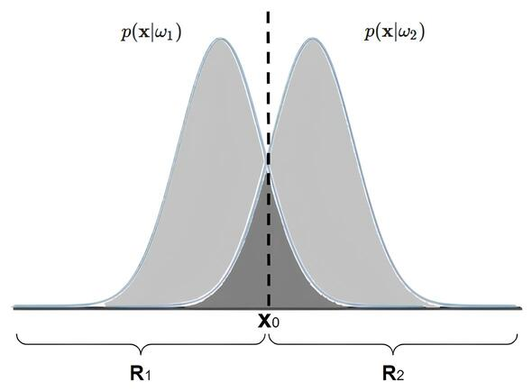

# Capítulo 1: Teoria da decisão de Bayes
A Teoria de Decisão de Bayes é uma abordagem estatística que busca realizar a tomada de deciões em situações incerteza, sendo capaz de atualizar as probabilidade de acordo com a obtenção de novas informações. A Inferência Estatística [^1] Bayesiana lida com os parâmetros como variáveis aleatórias, integrando informações anteriores ($\textit{a priori}$) e dados novos, gerando distribuições $\textit{a posteriori}$ que refinam as crenças iniciais sobre os parâmetros, realizando uma atualização contínua

A Regra de Bayes, demonstrada na equação 1, é uma equação que relaciona a ocorrência de dois eventos através de suas probabilidades condicionais. Sendo utilizada para calcular a probabilidade de um evento ocorrer, dado que outro evento já ocorreu.

$\begin{equation}
    P(A|B) = \frac{\text{P(B|A)P(A)}}{\text{P(B)}}\ \tag{2.1}
\end{equation}$ 

Onde:

*   P(A|B) é a probabilidade do evento A ocorrer dado que o evento B já ocorreu, ou seja, é a probabilidade $\textit{a posteriori}$ de A;
*   P(B|A) é a probabilidade do evento B ocorrer dado que o evento A já ocorreu, ou seja, é a probabilidade $\textit{a posteriori}$ de B;
*   P(A) é a probabilidade do evento A ocorrer independentemente do evento B, ou seja, é a probabilidade $\textit{a priori}$ de A;
*   P(B) é a probabilidade do evento B ocorrer independentemente do evento A, ou seja, é a probabilidade $\textit{a priori}$ de B;

Como ponto de partida, admite-se que os padrões são expressos de forma genérica por $x = [x_{1},...x_{n}]^T$, sobre os quais deseja-se inferir sua pertinência em uma dada classe em $Ω =  ${$ω_{1},...,ω_{c}$}. No contexto estatístico, a seguinte regra geral pode ser empregada para tal processo de classificação:

$\begin{equation}
    (\textbf{x},ω_{j}) \leftrightarrow arg_{ω_{j}\inΩ} max P(ω_{j}|\textbf{x}) \tag{2.2}
\end{equation}$ 

em que $P(ω_{j}|\textbf{x})$, denominada probabilidade $\textit{a posteriori}$, representa a probabilidade de $\textbf{x}$ pertencer a $ω_{j}$.

De modo geral, em um problema de classificação, a probabilidade $\textit{a posteriori}$ que compõe a regra expressa pela a equação anterior é desconhecida. No entanto, a Regra de Bayes possibilita o seu cálculo por meio da probabilidade $\textit{a priori}$ $P(ω_{j})$, da evidência $p(\textbf{x})$ e da função de verossimilhança $p(\textbf{x}|ω_{j})$:

$\begin{equation}
    P(ω_{j}|\textbf{x}) = \frac{p(\textbf{x}|ω_{j})P(ω_{j})}{p(\textbf{x})} \tag{2.3}
\end{equation}$ 

sendo $p(x) = \sum_{j=1}^{c} p(\textbf{x}|ω_{j})P(ω_{j})$. 

Uma vez conhecida $P(ω_{j}|\textbf{x})$, a classificação de $\textbf{x}$ segundo $ω_{j}$, com $j=1,...,c$, torna-se um problema simples.
Com o objetivo de aprofundar as discussões introduzidas, vamos realizar uma análise sobre o erro cometido ao utilizar a Regra de Bayes no processo de classificação. A fim de favorecer o entendimento, considere um problema de classificação entre apenas duas classes $ω_{1}$ e $ω_{2}$ equiprováveis, cujas observações estão definidas sobre o conjunto dos números reais (i.e., $\textbf{X} ≡ \mathbb{R}$), o qual é dividido entre as regiões $R_{1}$ e $R_{2}$. Enquanto a região $R_{1}$ compreende os valores $\textbf{x}$ tais que $P(ω_{1}|\textbf{x})>P(ω_{2}|\textbf{x})$. A Figura 2.1 ilustra a relação entre as regiões e as probabilidades mencionadas.

 
    
 <legend>Figura 1.1 - Regiões de decisão e de erro de classificação. Fonte:
</legend>

Segundo essas considerações, de acordo com a equação 2.4, é possível expressar a probabilidade do erro de classificação na quantificação da probabilidade do padrão $\textbf{x}$ pertencer à região $R_{2}$, apesar da sua classe original ser $ω_{1}$. 

 

$\begin{equation}
P_{erro} = P(\textbf{x} ∈ R_{2},ω_{1}) + P(\textbf{x} ∈ R_{1},ω_{2}) \tag{2.4}
\end{equation}$ 

A partir da equação 2.4 é possível demonstrar que o erro se torna mínimo ao garantir que $P(ω_{2}|\textbf{x}) < P(ω_{1}|\textbf{x})$, quando $\textbf{x}\inω_{1}$, e $P(ω_{1}|\textbf{x})< P(ω_{2}|\textbf{x})$, para $\textbf{x}\in ω_{2}$ (equação 2.5). De fato, ao mover o ponto $\textbf{x}_{0}$, conforme apresentada a Figura 2.2, verifica-se que a região associada à ocorrência de erro de classificação tem sua área aumentada.

$\begin{equation}
P_{erro} = P(\textbf{x} ∈ R_{2},ω_{1}) + P(\textbf{x} ∈ R_{1},ω_{2}) = [ \int_{R_{2}} p(\textbf{x}|ω_{1}) \,dx]P(ω_{1}) + [ \int_{R_{1}} p(\textbf{x}|ω_{2}) \,dx]P(ω_{2}) = \frac{1}{2}\int_{R_{2}} p(\textbf{x}|ω_{1}) \,dx + \frac{1}{2}\int_{R_{1}} p(\textbf{x}|ω_{2}) \,dx = \frac{1}{2}[\int_{R_{2}} p(\textbf{x}|ω_{1}) \,dx + \int_{R_{1}} p(\textbf{x}|ω_{2})\,dx] \tag{2.5}
\end{equation}$ 

<legend>Figura 1.2 - Noção de erro dada a alteração sobre as regiões de decisão.
</legend>

Considerando as discussões acima, retoma-se o espaço de classes $Ω={ω_{1},...,ω_{c}}$, de modo que $\textbf{x}$ está associado a $ω_{i}$ se $P(ω_{i}|\textbf{x}) > P(ω_{j}|\textbf{x})$, para $i \neq j$ e $j=1,...c$. Ademais, é possível associar um risco a cada decisão tomada, sendo uma forma de penalidade por uma classificação incorreta. Por exemplo, a escolha de $ω_{1}$ em vez de $ω_{2}$ pode ter um impacto maior ao se decidir por $ω_{2}$ como alternativa a $ω_{1}$.

Neste contexto, sendo $R_{i}$ a região do espaço de atributos que induz a classificação em $ω_{i}$. Admitindo $λ_{ki}$ como penalidade relacionada à escolha equivocada da $ω_{i}$, cuja opção correta seria optar pela classe $ω_{k}$. Baseado neste conceito, o risco associado à classe $ω_{k}$ é dado por:

$\begin{equation}
\sum_{i=1}^{c} λ_{ki} \int_{R_{i}} p(\textbf{x}|ω_{jk})dx; k=1,...c \tag{2.6}
\end{equation}$ 

A quantidade $\int_{R_{i}} p(\textbf{x}|ω_{jk})dx$ representa a probabilidade do padrão $\textbf{x}$, que, apesar de original da classe $ω_{k}$, ocorre na região $R_{i}$. Geométricamente, $r_{k}$ representa a "área invadida" por $p(\textbf{x}|ω_{k})$ nas regiões $R_{i}$, com $i=,...c$ e $i \neq k$.

Uma forma de expressar o risco médio de $r$, segundo todas as classes, é tomar a combinação linear expressa pelo risco associado a cada classe e sua propagação, ou seja, probabilidade, de ocorrência:

$\begin{equation}
r = \sum_{k=1}^{c} r_{k}P(ω_{k}) = \sum_{k=1}^{c} [\sum_{i=1}^{c} λ_{ki} \int_{R_{i}} p(\textbf{x}|ω_{k})dx]P(ω_{k}) = \sum_{k=1}^{c} \int_{R_{i}} [\sum_{i=1}^{c} λ_{ki} p(\textbf{x}|ω_{k}) P(ω_{k})]dx \tag{2.7}
\end{equation}$

fazendo $\sum_{i=1}^{c} λ_{ki} p(\textbf{x}|ω_{k}) P(ω_{k}) = l_{i}$, têm-se:

$\begin{equation}
r = \sum_{k=1}^{c} \int_{R_{i}} l_{i} dx \tag{2.8}
\end{equation}$ 

A manipulação algébrica realizada proporciona uma reinterpretação que expressa o risco médio em função das regiões $R_{i}$. Dessa forma, pode-se concluir mais uma vez que a minimização do risco $r$ é alcançada ao estabelecer cada região $R_{i}$, com $i=1,...c$, tais que $l_{i}<l_{j}$, para $j=1,...c$ e $j \neq i$.

Vale observar que $l_{i}$ representa o risco em classificar $\textbf{x}$ como $ω_{i}$, enquanto deveria ser $ω_{k}$, para $k=1,...c$. Logo, busca-se não confundir as demais classes com $ω_{i}$.

Mais uma vez, e sem perda de generalidade, toma-se como um problema binário com $Ω = {ω_{1},ω_{2}}$. Neste caso, tem-se as probabilidades $λ_{11},λ_{21},λ_{12}$ e $λ_{22}$ e os riscos:

 

$\begin{equation}
l_{1} = λ_{11}p(\textbf{x}|ω_{1})P(ω_{1}) + λ_{21}p(\textbf{x}|ω_{2})P(ω_{2})
\end{equation}$

$\begin{equation}
l_{2} = λ_{12}p(\textbf{x}|ω_{1})P(ω_{1}) + λ_{22}p(\textbf{x}|ω_{2})P(ω_{2})
\end{equation}$ 

Optando pela classe $ω_{1}$ desde que $l_{1} < l_{2}$, é estabelecida a seguinte razão de verossimilhança[^2]:

 

$\begin{equation}
l_{12} = \frac{p(\textbf{x}|ω_{1})}{p(\textbf{x}|ω_{2})} > \frac {P(ω_{2})λ_{21}-λ_{22}}{P(ω_{2})λ_{12}-λ_{11}} \tag{2.9}
\end{equation}$ 

De modo análogo, a razão $l_{21}$ é obtida partindo da condição $l_{2} < l_{1}$. Simplificando a razão obtida ao caso em que as classes são equiprováveis (i.e., $P(ω_{1})=P(ω_{2})=\frac{1}{2}$) e assumindo que não há penalidade ao optar por $ω_{i}$ quando esta é a classe esperada (i.e., $λ_{ij}=0$ se $i=j$), pode-se traçar as seguintes regras de decisão:

 

$\begin{equation}
(\textbf{x},ω_{1}) \Leftrightarrow  p(\textbf{x}|ω_{1}) > p(\textbf{x}|ω_{2}) \frac{λ_{21}}{λ_{12}}
\end{equation}$

$\begin{equation}
(\textbf{x},ω_{2}) \Leftrightarrow  p(\textbf{x}|ω_{1}) > p(\textbf{x}|ω_{1}) \frac{λ_{12}}{λ_{21}}
\end{equation}$ 

Cabe notar que, ao admitir $λ_{12} = λ_{21}$, as regras desenvolvidas recaem no caso de minimização do erro de classificação, abordado anteriormente. Por outro lado, para $λ_{21} > λ_{12}$, tem-se como efeito colateral uma maior tendência sobre a escolha de $ω_{2}$ em comparação a $ω_{1}$. Naturalmente, ao passo que a diferença $λ_{21} - λ_{12}$ aumenta, maior é a tendenciosidade revelada.

[^1]: Processo de inferir características de uma população por meio da observação de uma amostra. Inserir citação
[^2]: Medida utilizada para comparar a probabilidade de observação de um dado sob diferentes hipóteses.