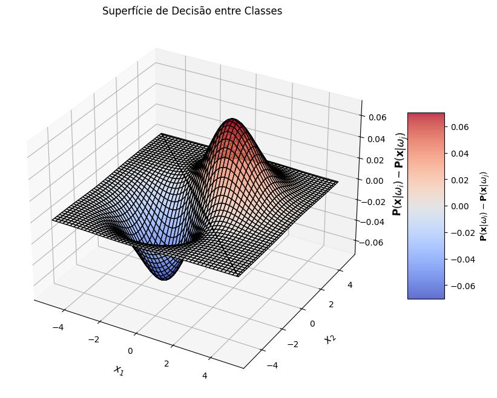

# 1.3: Funções discriminantes e superfíceies de decisão

Baseado no conceito da mionimização do erro de classificação e maximização da propabilidade $\textit{a posteriori}$, pode-se estipular como regra:

$\begin{equation}
    p(\textbf{x}|ω_{i}) \leftrightarrow P(ω_{i}|\textbf{x}) - P(ω_{j}|\textbf{x}) > 0; i \neq j; j=1,....,c \tag{2.14}
\end{equation}$ 

De forma oportuna, o lugar geométrico em que $P(ω_{i}|\textbf{x}) - P(ω_{j}|\textbf{x}) = 0$ determina uma $\textit{superfície de decisão}$. Uma forma de desvincilhar as regras de decisão das respectivas regiões do espaço de atributos, simplicando a notação, consiste em reinterpretá-las como funções que realizam a discriminação de uma determinada classe com relação às demais. Tais $\textit{funções discriminantes}$ são expressas por: 

$\begin{equation}
    g_{i}(\textbf{x}) = f(P(ω_{i}|\textbf{x})) \tag{2.15}
\end{equation}$ 

sendo $f(.)$ uma função monotônica crescente ou decrescente[^1] que garante que $g_{i}(\textbf{x}) = g_{j}(\textbf{x})$ somente quando $P(ω_{i}|\textbf{x}) = P(ω_{j}|\textbf{x})$.

Em posse da representação na forma de funções discriminantes, uma superfície de decisão que delimita a decisão entre duas classes $w_{i}$ e $w_{j}$ passa a ser definida por $g_{ij}(\textbf{x}) = g_{i}(\textbf{x}) - g_{j}(\textbf{x}) = 0$, para quaisquer $i \neq j$. A Figura 1.3 auxilia na caracterização do conteito de superfície de decisão, destacado pela curva de nível de valor zero.

 
    
 <legend>Figura 1.3 - Distribuicao de probabilidade de classes distintas. Fonte: Elaborado pelo autor.
</legend>

[^1]: Uma função $f: \mathbb{R} \to \mathbb{R}$ é monotônica crescente se, dado $x, y \in \mathbb{R}$ e $x < y$, então $f(x) \leq f(y)$. Analogamente, $f$ é monotônica decrescente sem dado $x, y \in \mathbb{R}$ e $x > y$, então $f(x) \leq f(y)$.