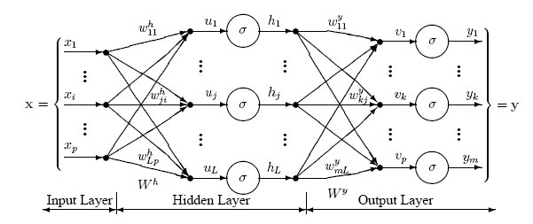

# 3.1: Perceptron multicamadas e o algoritmo $\textit{backpropagation}$

O algoritmo Percetron da forma proposta por Rosenblat foi colocado em descrença após a publicação do trabalho de Minsky e Seymour Pepert [Minsky and Seymour, 1969], pois este trabalho demonstrava diversas fragilidades que o Perceptron possuía ao tentar utilizar o médoto para resolver uma série de problemas triviais. Um destes problemas é simular o funcionando de uma porta lógica XOR[^1], sendo considerado um problema simples a ser resolvido. Para tornar o problema factível, é necessário empregar duas superfícies de decisão para caracterizar as saídas desejadas da operação XOR. De acordo com a Figura 3.2 os dados originias que caracterizam a porta lógica XOR são remapeados para um espaço intermediário, caracterizado pelas saídas das portas lógicas AND (${z_1}$) e OR (${z_2}$) que, por sua vez, são distinguidas por uma terceira superfície. 

   

 <legend>Figura 3.2 - Emprego de duas superfícies que remapeiam os dados em um problema linearmente separável.</legend> 

Essa combinação realizada entre superfícies lineares transforma o processo em uma abordagem não linear. As etapas que levaram à solução apresentada podem ser interpretadas através de três Perceptrons independentes. Em conformidade com o modelo de neurônio de McCulloc-Pitts a combinação desses perceptrons gera uma rede de neurônios artificiais (ou rede neural artificial) representada na Figura 3.3. 

   

 <legend>Figura 3.3 - Arquitetura do Perceptron multicamadas que resolver o operador XOR. Fonte: Goldstraw, 2022.</legend> 

A arquitetura de uma rede neural representada na Figura 3.4 possui: uma $\textit{camada de entrada}$, que recebe os dados no espaço de atributos original; seguido por uma $\textit{camada oculta}$  (ou $\textit{escondida}$) de neurônios, que realizam mapeamentos para um novo espaço de atributos; cujos resultados são inseridos em uma última camada, denominada $\textit{camada de saída}$, responsável por gerar o resultado. As funções de ativação usadas na modelagem deste problema são ditas "binárias", isto é, 

$\begin{equation}
    g_j(z) =
    \begin{cases}
    1 & \text{se } z \geq 0 \\
    0 & \text{se } z < 0
    \end{cases}
    \quad , \ j = 1, 2, 3 \tag{3.1}
\end{equation}$ 

De modo geral, a composição de uma rede de neurônios na forma como foi discutida caracteriza o método denominado Perceptron Multicamadas (MLP, do inglês $\textit{Multilayer Perceptron}$). Diversas arquiteturas de MPL podem ser empregadas de acordo com o problema de classificação, os ajustes necessários dependerão, dentre outros fatores, do problema que se deseja solucionar. A Figura 3.4 apresenta uma rede MLP em que se pode observar a relação entre os pesos sinápticos e os neurônios que ocupam as diferentes camadas. 

   

 <legend>Figura 3.4 - Exemplo de rede neural de múltiplas camadas. Fonte: DTREG, 2025.</legend> 

Além da complexidade que abrange a determinação da arquitetura da rede de neurônios, a determinação dos pesos associados a cada conexão é uma questão fundamental na modelagem de uma rede neural. No ponto de vista do aprendizado supervisionado, os pesos são ajustados iterativamente com base nas informações rotuladas e disponíveis em um conjunto $D$, dessa forma, simulando um processo de aquisição de conhecimento. Para essa finalidade, é empregado o algoritmo $\textit{backpropagation}$. Este algortimo funciona de forma que para cada estímulo apresentado, a resposta gerada é comparada ao retorno esperado, que por sua vez, pode proporcionar uma onda de autoajuste no sentido contrário, ou seja, de forma retropropagada.

De modo genérioco, uma rede neural é composta por $L \in \textbf{N}^*\ $ camadas. Cada camada $l = 1, \ldots, L$ possui $h_l$ neurônios. Os neurônios que ocupam duas camadas consecutivas são conectados a fim de permitir a propagação de um sinal através da rede neural, da camada de entrada até a saída. As conexões são ponderadas por um peso sináptico $w_{uv}$, referente à conexão entre os neurônios \[$u$\] e \[$v$\], sendo \[$v$\] pertencente a uma camada anterior à camada de \[$u$\].

Cada neurônio \[$u$\] é conectado a unma entrada que emite sinal constante igual a $+1$, cuja ligação é ponderada por $w_{u0}$. Tal conexão atua como termo polarizador ($\textit{bias}$) no processo de treinamento da rede.

Considere o neurônio \[$u$\], um neurônio estritamente localizado na saída da rede neural, após a apresentação do padrão $x_i$ na entrada da rede, define-se o "erro observado" pela expressão:

$\begin{equation}
    e_{u}(i) = y_{u}(i) - z_{u}^{(L)}(i) \tag{3.2}
\end{equation}$ 

 

em que $y_{u}(i)$ e $z_{u}^{(L)}(i)$ se referem ao retorno esperado e obtido, respectivamente; ambos com relação ao neurônio \[$u$\]. Vale ressaltar que $y_{u}(i)$ é a $u$-ésima componente do vetor $\textbf{y}_i$, conhecimento através de $D$.

O valor $\frac{1}{2}e_{u}(i)$ sobre \[$u$\] é definido por "valor instantâneo de energia do erro", por sua vez, é estabelecido como "valor instantâneo de energia do erro total" a soma da energia do erro que surge de cada neurônio na camada de saída como:

$\begin{equation}
    E(i) = \frac{1}{2} \sum_{u=1}^{h_L} e_{u}^{2}(i) \tag{3.3}
\end{equation}$ 

A partir de 3.3 é possível obter o valor médio dos $E_(i)$; $i = 1, \ldots , m$, computado após a apresentação à rede neural de todos os padrões em $D$, sendo esta uma função de todos os pesos sinápticos existentes na rede, tendo como objetivo avaliar o desempenho. O dados de treinamento não apresentados um a um a rede, em instantes "distintos". Esse processo deve ser repetido diversas vezes até que a convergência seja alcançada. A apresentação de todos os exemplos em $D$ será denominada "época. Em cada época, a ordem em qu eos exemplos são apresentados deve mudar; por sua vez, a indexação definida por $i$ em ($x_i$, $y_i$) sofrerá alteração. Esse procedimento visa a eliminar possíveis viéses causados pela ordem com que a rede é ajustada.

O neurônio \[$u$\], situado na saída da rede neural, recebe os sinais $z_{u}^{(L-1)}(1),\ldots,z_{u}^{(L-1)}(v),\ldots ,z_{u}^{(L)}(h_{L-1})$ emitidos pelos neurônios à sua esquerda. Esses sinais são ponderados pelos pesos $w_{u1},\ldots,w_{uv},\ldots,w_{uh_{L-1}}$ das respectivas conexões sinápticas e induzem um "campo local" $t_{u}(i)$, definido por:

$\begin{equation}
    t_{u}^{(L)} = \sum_{j=1}^{h_{L-1}} w_{uj}z_{j}^{(L-1)}(i) \tag{3.4}
\end{equation}$ 

Posteriormente, o campo local é transformado em um sinal funcional emitido por $[u]$ (Equação 3.2) que permite o cálculo do erro em $[u]$ e, indiretamento, o valor instantâneo da energia do erro (Equação 3.3). 

Com o intuito de ajustar os valores dos pesos sinápticos que minimizam o erro na saída da rede, o algoritmo $\textit{backpropagation}$ aplica sucessivas correções $\Delta w_{uv}$ sobre cada peso $w_{uv}$. O valor $\Delta w_{uv}$ é proporcional à taxa de variação do ero com relação à , isto é, $\frac{\partial E(i)}{\partial w_{uv}}$.Tal taxa corresponde a um fator de sensibilidade e determina a direção em que se deve buscar o novo peso e corrigir o $w_{uv}$. Utilizando a regra da cadeia, e resolvendo-as, se obtem:

$\begin{equation}
    - e_{u}(i) \cdot \varphi' \left( t_{u}^{[L]}(i) \right) \cdot z_{u}^{[L]}(i) \tag{3.5}
\end{equation}$ 

A correção de $\Delta w_{uv}$ é proporcional a $\frac{\partial E(i)}{\partial w_{uv}}$. Assim, pode-se definir:

$\begin{equation}
    \Delta w_{uv} = - \eta \cdot \frac{\partial E(i)}{\partial w_{uv}} =  \eta \cdot e_{[u]}(i) \cdot \phi' \left( t_{u}^{[L]}(i) \right) \cdot z_{u}^{[L]}(i) \tag{3.6}
\end{equation}$ 

em que $\eta in \textbf{R}_+$ estabelece a proporcionalidade citada, atuando no contexto do algoritmo como uma taxa de aprendizado; o sinal "-" é proveniente da estratégia do Gradiente Descendente, sendo este um fator chave no ajuste dos pesos sinápticos da rede.

O produto $e_{[u]}(i) \cdot \varphi' \left( t_{u}^{[L]}(i) \right)$ define um "gradiente local", denotado aqui por $\delta_{[u]}^{[L]}(i)$, se refere ao erro proporcionado em relação ao campo induzido em \[$u$\] diante da apresentação de $\textbf{x}_i$. Logo:

$\begin{equation}
    \delta_{[u]}^{[L]}(i) = e_{[u]}(i) \cdot \varphi' \left( t_{u}^{[L]}(i) \right) \tag{3.7}
\end{equation}$ 

evidenciando que o erroobservado no neurônio é de suma importância para os ajustes locais dos pesos sinápticos.

Como evidenciado através da própria arquitetura da rede neural, os valores dos erros são conhecidos apenas na camada de saída. Porém, o ajuste dos pesos sinápticos deve ocorrer ao longo de toda a rede. Essa questão desdobra-se em dois casos particulares:

(i). \[$u$\] é um neurônio de saída, então sua resposta esperada (ou desejada) já é conhecida de antemão, dado ($\textbf{x}_i$ $\textbf{y}_i$ \in D), logo o cálculo do erro se torna direto;

(ii). \[$u$\] é um neurônio oculto e exerce influência no comportamento da rede, logo seu peso deve ser ajustado de forma indireta a partir do erro obtido nos neurônios da camada de saída.

A respeito do primeiro caso, têm-se $\delta_{[u]}^{[L]}(i)$ definido exatamente através da Equação 3.7. Para o segundo caso, a expressão do gradiente locla parte considerando:

$\begin{equation}
    \delta_{[u]}^{[L]}(i) = - \frac{\partial E(i)}{\partial z_{[u]}^{[L-1]}} \cdot \frac{\partial z_{u}^{[L-1]}(i)}{\partial t_{u}^{[L-1]}(i)}
     = \frac{\partial E(i)}{\partial z_{u}^{[L-1]}(i)} \cdot \varphi'\left( t_{u}^{[L]}(i) \right) \tag{3.8}
\end{equation}$ 

Realizando as devidas manipulações matemática e a combinação das expressões derivadas, a seguindo expressão é alcançada:

$\begin{equation}
    \delta_{[u]}^{[L-1]}(i) = \left( \sum_{k=1}^{h_L} \delta_{k}^{[L]}(i) \cdot w_{ku} \right) \cdot \varphi'\left( t_{u}^{[L]}(i) \right) \tag{3.9}
\end{equation}$ 

O termo $\varphi'\left( t_{u}^{[L]}(i) \right)$ é obtido com relação ao campo local $\left( t_{u}^{[L]}(i) \right)(i)$ gerado no momento da propagação do sinal de entrada.

O desenvolvido dessas expressões proporciona o gradiente local sobre o neurônio \[$u$\] que antecede a camada de saída. De qualquer forma, o gradiente é expresso em função dos gradientes da camada posterior. Sendo assim, para neurônios que antecedem \[$u$\], o cálculo do respectivo gradiente local sera dado pelos neurônios da camada de \[$u$\], e assim sucessivamente até a primeira camada da rede neural.

Ao fim deste raciocínio, é possível concluir que a correção feita sobre cada peso sináptico que se conecta a \[$u$\] a partir de \[$v$\] é dada por:

$\begin{equation}
    w_{uv} := w_{uv} + \Delta w_{uv} 
\end{equation}$ 

$\begin{equation}
    \Delta w_{uv} = \eta \cdot \delta_{[u]}^{[L]}(i) \cdot z_{u}^{[L]}(i) \tag{3.10}
\end{equation}$ 

tal que:

* $\delta_{[u]}^{[L]}(i) = \varphi'\left( t_{u}^{[L]}(i) \right) \cdot e_{[u]}(i)$ se \[$u$\] está na $L$-ésima camada;
* $\delta_{[u]}^{[L]}(i) = \varphi'\left( t_{u}^{[L]}(i) \right) \cdot \left( \sum_{k=1}^{l+1} \delta_{[k]}^{[l+1]}(i)w_{ku} \right)$, se \[$u$\] está na $l$-ésima camada, com $l \ne L$.

## 3.1.1: Funções de ativação, taxa de aprendizado e convergência

Dois elementos chave no treinamento da rede MLP são as funções de ativação e a taxa de aprendizado. Devido à natureza iterativa, o método MLP é treinado até que determinado critério de convergência seja atingido.

As $\textit{funções de ativação}$ associadas aos neurônios da rede são responsáveis pela caracterização das respostas geradas por cada um deles, bem como são utilizadas no cálculo dos diferentes gradientes locais. 

Ao longo da execução do algoritmo $\textit{backpropagation}$, são obtidas aproximações para configurações dos pesos da rede. Admitindo valores pequenos para a $\textit{taxa de aprendizado}$ $\eta$ , menores serão as variações dos pesos sinápticos, dessa forma, levando a um aprendizado "suave" e lento. Por outro lado, quando adotados valores maiores para tal parâmetro, as atualizações sobre os pesos sinápticos podem atingir largas escalas, tornando o aprendizado da rede um processo instável.

Dentre exemplos de funções de ativação utilizadas nesse propósito, são as funções $\textit{identidade} \varphi(t) = t$ e RELU[^2] $\varphi(t) = max \{0,t\}$. As respectivas formas derivadas são triviais.

Uma forma de aumentar a taxa de aprendizado e evitar possíveis instabilidades é proposta pela seguinte alteração no termo $\Delta w_{uv}$ presente na equação 3.10:

$\begin{equation}
    \Delta w_{uv} = \chi \Delta w_{uv}(i - 1) + \eta \cdot \delta_{[u]}^{[L]}(i) \cdot z_{u}^{[l-1]}(i) \tag{3.11}
\end{equation}$ 

sendo $\Delta w_{uv}(i - 1) = \eta \cdot \delta_{\left[u\right]}^{\left[L\right]}(i - 1) \cdot z_{u}^{\left[l-1\right]}(i - 1); e\chi \in \left[0,1\right[$ denominado por $\textit{constante de momento}$.

Por fim, como $\textit{critério de convergência}$ é razoável admitir convergência quando os valores de $\overline{E}$ estacionam ao longo das épocas. Outro critétrio é observar a convergência em relação ao desempenho da rede diante de exemplos contidos em um conjunto de validação.

## 3.1.2: Indicadores de classe e a camada de saída

Diferente das abordagens anteriores, o indicador de classes utilizado no método MLP segue uma forma vetorial. Este formato visa traçar uma compatibilização entre o número de classes envolvidas no problema de classificação, determinando a quantidade de neurônios na camada de saída.

Supondo que um problema compreende $c$ classes é necessário $c$ neurônios na cama de saída, sendo que cada neurônio na saída corresponde a uma classe específica. Dessa forma, a organização das respostas geradas por cada neurônio em um formato vetorial é comparada a uma dada resposta esperada.

Como dito anteriormente, as respostas geradas e esperadas pelos neurônios da camada de saída correspondem a $z_{u}^{[L]}$ e $y_[u]$ conforme a Equação 3.2. Para um padrão $\textbf{x}$ cuja classe associada é $\omega_j$, tem-se que $y_{[j]} = 1$ e $y_{[u]} = 0$ para $u \neq j$. Para este mesmo exemplo, é esperado que $z_{i}^{[L]}$ apresente valor superior aos demais $z_{u}^{[L]}$ com $u \neq i$.
Convenientemente, estes valores são organizados por e $\textbf{z} = z_{1}^{[L]},\ldots,z_{c}^{[L]}$, dessa forma, permitindo um melhor tratamento algébrico, conforme abordado a seguir.

## 3.1.3 Modelagem algébrica do algoritmo $\textit{backpropagation}$

A seguir será apresentado a modelagem algébrica que envolve a aplicação do algoritmo $\textit{backpropagation}$ no treinamento da MLP. A modelagem aqui apresentada pode ser facilmente estendida para quaisquer arquiteturas de rede em que se tenha interesse. Os passos descritos a seguir contemplam apenas a apresentação de um único exemplo de rede neural, apresentado na Figura 3.5, cujo erro obtido na saída é retropropagado a fim de corrigir os pesos sinápticos.

   

 <legend>Figura 3.5 - Arquitetura da rede considerada no exemplo algébrico. Fonte: Elaborada pelo autor.</legend>

Seja $\textbf{x}_i$ um padrão extraído de $D$ e apresentado na entrada do perceptron considerado. O csmpo induzido sobre os neurônios da primeira camada é:

$\begin{equation}
    t^{[1]} = 
    \begin{bmatrix}
    w_{10} & w_{11} & w_{12} \\
    w_{20} & w_{21} & w_{22}
    \end{bmatrix}^{[1]}
    \cdot
    \begin{bmatrix}
    +1 \\
    x_{i1} \\
    x_{i2}
    \end{bmatrix} 
    = W^{[1]} \cdot z^{[0]^T}; \\
    t^{[1]} = 
    \begin{bmatrix}
    t_{[1]}(i) \\
    t_{[2]}(i)
    \end{bmatrix}
\end{equation}$ 

em que $\textbf{z}^{[0]} \equiv \textbf{x}_i$. Vale observar que, nas notações acima, a matriz dos pesos sinápticos e o vetor do campo induzido são denotados em função da camada que ocupam. Nesse caso, o superescrito "$[1]$" identifica os pesos e sinais que ocorrem na primeira camada.

Por sua vez, a aplicação da função de ativação $\varphi(\cdot)$ sobre os campos induzidos em cada neurônio é resumida por $\varphi(\textbf{t}^{[1]}) = \begin{matrix} t_{[1]}(i)\\ t_{[2]}(i) \end{matrix}$, que logo se torna equivalente a $\textbf{z}^{[1]}$.

Diante da próxima camada, a matriz de peso possuit $(3 + 1)$ linhas e $(2 + 1)$ colunas, uma vez que devemos garantir a estrutura que interliga os dois neurônios da primeira camada com os três neurônios da segunda camada e incluir o "bias", consequentemente garantindo compatibilidade na multiplicação matricial que segue. No exemplo ilustrado:

$\begin{equation}
    \begin{bmatrix}
    w_{10} & w_{11} & w_{12} \\
    w_{20} & w_{21} & w_{22} \\
    w_{30} & w_{31} & w_{32}
    \end{bmatrix}^{[2]} \cdot \begin{bmatrix}
    +1 \\
    z_{[1]}(i) \\
    z_{[2]}(i)
    \end{bmatrix} = \textbf{W}^{[2]} \cdot \textbf{z}^{[1]^T}; \textbf{t}^{[2]} = 
    \begin{bmatrix}
    t_{[1]}(i) \\
    t_{[2]}(i) \\
    t_{[3]}(i)
    \end{bmatrix}
\end{equation}$ 

e tão logo temos $\textbf{z}^{[2]} = \varphi(\textbf{^t}^{[2]})$.

Da mesma forma:

$\begin{equation}
    \begin{bmatrix}
    w_{10} & w_{11} & w_{12} & w_{13} \\
    w_{20} & w_{21} & w_{22} & w_{23} \\
    \end{bmatrix}^{[3]} \cdot \begin{bmatrix}
    +1 \\
    z_{[1]}(i) \\
    z_{[2]}(i) \\
    z_{[3]}(i)
    \end{bmatrix} = \textbf{W}^{[3]} \cdot \textbf{z}^{[2]^T}; \textbf{t}^{[3]} = 
    \begin{bmatrix}
    t_{[1]}(i) \\
    t_{[2]}(i)
    \end{bmatrix}
\end{equation}$ 

As etapas apresentadas até este ponto contemplam o processo de alimentação, no qual a informação apresentada na entrada da rede é propagada até a saída. Os próximos passos abrangem o cálculo do erro na saída e a correção dos pesos sinápticos com base na retropropagação do erro calculado.

Perante a resposta observada na última camada e com base nas discussões referentes à Equação 3.7, é possível expressar:

$\begin{equation}
    \delta^{[3]} = diag(\textbf{y}_i - \textbf{z}^{[3]}) \cdot \varphi'\left(\textbf{t}^{[3]}\right) = 
    \begin{bmatrix}
    e_{[1]} & 0 \\
    0 & e_{[2]} \\
    \end{bmatrix} \cdot \begin{bmatrix}
    \varphi'(t_{[1]})\\
    \varphi'(t_{[2]})
    \end{bmatrix}^{[3]} =
    \begin{bmatrix}
    \delta_{[1]}(i) \\
    \delta_{[2]}(i)
    \end{bmatrix}^{[3]}
\end{equation}$ 

em que $diag(\cdot)$ equivale a uma função que reescreve um vetor na forma de uma matriz diagonal, cujos elementos distribuídos ao longo da diagonal correspondem às comonentes do vetor original e na mesma sequência com que ele é observado.

Por sua vez, a correção nesta camada é dada por: 

$\begin{equation}
    \delta^{[3]} = diag(\textbf{y}_i - \textbf{z}^{[3]}) \cdot \varphi'\left(\textbf{t}^{[3]}\right) = 
    \begin{bmatrix}
    w_{10} & w_{11} & w_{12} & w_{13} \\
    w_{20} & w_{21} & w_{22} & w_{23} 
    \end{bmatrix}^{[3]} := \begin{bmatrix}
    w_{10} & w_{11} & w_{12} & w_{13} \\
    w_{20} & w_{21} & w_{22} & w_{23} \end{bmatrix}^{[3]}
\end{equation}$ 

$\begin{equation}
    + \eta \begin{bmatrix}
    \delta_{[1]}(i) \\
    \delta_{[2]}(i)
    \end{bmatrix}^{[3]} \cdot
    \begin{bmatrix}
    1 & z_{[1]}^{[2]}(i) & z_{[2]}^{[2]}(i) & z_{[3]}^{[2]}(i)
    \end{bmatrix}
\end{equation}$ 

de modo que o lado esquerdo da expressão acima corresponde à correção dos pesos da última camada.

Posteriormente, é feita a correção dos pesos da segunda camada de neurônios. Para este caso, serão computados os gradientes locais $\delta_{[1]}^{[2]}$, $\delta_{[2]}^{[2]}$ e $\delta_{[3]}^{[2]}$, os quais dependem dos gradientes $\delta_{[1]}^{[3]}$ e $\delta_{[3]}^{[2]}$ obtidos na terceira camada, conforma formalizado pela Equação 3.8:

$\begin{equation}
    \delta^{[2]} = -diag\left(
        \begin{bmatrix}
        delta_{[1]}^{[3]} & delta_{[2]}^{[3]}
        \end{bmatrix} \cdot 
        \begin{bmatrix}
        w_{10} & w_{11} & w_{12} & w_{13} \\
        w_{20} & w_{21} & w_{22} & w_{23} 
        \end{bmatrix}^{[3]}
    \right) \cdot \varphi'\left(\textbf{t}^{[2]}\right)
\end{equation}$ 

Vale notar que, para a obtenção de $\delta^{[2]}$, a matriz de pesos sinápticos não inclui o bias, uma vez que não há conexão entre ele e os neurônios da segunda camada.

Em seguida, a correção dos pesos é efetuada com:

$\begin{equation}
    \begin{bmatrix}
    w_{10} & w_{11} & w_{12} & w_{13} \\
    w_{20} & w_{21} & w_{22} & w_{23} 
    \end{bmatrix}^{[2]} := \begin{bmatrix}
    w_{10} & w_{11} & w_{12} & w_{13} \\
    w_{20} & w_{21} & w_{22} & w_{23} \end{bmatrix}^{[2]}
\end{equation}$ 

$\begin{equation}
    + \eta \begin{bmatrix}
    \delta_{[1]}(i) \\
    \delta_{[2]}(i) \\
    \delta_{[3]}(i)
    \end{bmatrix}^{[2]} \cdot
    \begin{bmatrix}
    1 & z_{[1]}^{[1]}(i) & z_{[2]}^{[1]}(i)
    \end{bmatrix}
\end{equation}$ 

Ao fim, a correção dos pesos da camada de entrada se inicia com o cálculo dos gradientes locais:

$\begin{equation}
    \delta^{[1]} = -diag\left(
        \begin{bmatrix}
        delta_{[1]}^{[2]} & delta_{[2]}^{[2]} & & delta_{[3]}^{[2]}
        \end{bmatrix} \cdot \begin{bmatrix}
        w_{11} & w_{12}\\
        w_{21} & w_{22} \\
        w_{31} & w_{32}
        \end{bmatrix}^{[2]}
    \right) \cdot \begin{bmatrix}
        \varphi'(t_{[1]}^{[1]})\\
        \varphi'(t_{[2]}^{[1]})
        \end{bmatrix}^{[1]}
\end{equation}$ 

seguido pela correção dos pesos sinápticos:

$\begin{equation}
    \begin{bmatrix}
    w_{11} & w_{12} & w_{13} \\
    w_{21} & w_{22} & w_{23} 
    \end{bmatrix}^{[1]} := \begin{bmatrix}
    w_{11} & w_{12} & w_{13} \\
    w_{21} & w_{22} & w_{23} \end{bmatrix}^{[1]}
\end{equation}$ 

$\begin{equation}
    + \eta \begin{bmatrix}
    \delta_{[1]}(i) \\
    \delta_{[2]}(i)
    \end{bmatrix}^{[1]} \cdot
    \begin{bmatrix}
    1 & z_{[1]}^{[0]}(i) & z_{[2]}^{[0]}(i)
    \end{bmatrix}
\end{equation}$ 

lembrando que $\begin{bmatrix} z_{[1]}^{[0]}(i) & z_{[2]}^{[0]}(i) \end{bmatrix}$ corresponde ao padrão de entrada $\begin{bmatrix} x_{[i1]} & x_{[i2]} \end{bmatrix}$.

[^1]: Porta lógica OU exclusive (XOR, do inglês $\textit(Exclusive OR)$) é uma porta lógica que realiza uma operação OU entre duas variáveis, mas sua saída só será verdadeira (1) se e somente se uma das entradas é verdadeira. Ou seja, caso as duas sejam verdadeiras (1), o resultado será falso(0). O mesmo vale para o caso das duas variáveis serem falsa( 0 & 0 $\leftrightarrow$ 0). A representação genérica para qualquer par de entradas $\textbf{A}$ e $\textbf{B}$ para a operação XOR é $\textbf{A} \oplus \textbf{B} = (\textbf{A} \& \neg \textbf{B}) \vee (\neg \textbf{A} \& \textbf{B})$

[^2]: Acrônimo de $\textit{Rectified Linear Unit}$.